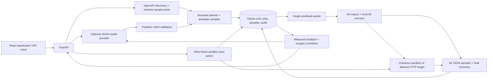

# Implemented backend architecture

The worker may run in the API lifespan for a local demo, or as `python -m loadpilot.worker` with `LOADPILOT_EMBEDDED_WORKER=false` on the API. SQLite claims are atomic across processes. Only one job per database runs at a time so sandbox measurements do not overlap. This is a local control plane, not a distributed execution cluster.

Jobs and scheduled times persist across API restarts. Canceled jobs never resume. Graceful worker shutdown kills its active k6 process. After an abrupt worker crash, the queue conservatively holds the workload slot until the execution timeout plus a margin has elapsed; it then records interruption without replaying traffic. It does not resume an interrupted soak test.

The model extracts a limited intent schema. Plans, budgets, generated code, endpoint bindings, correlations, calculations and action permissions are deterministic. AI narrative is qualitative and evidence-ID checked; exact measurements are rendered separately. Provider failures during parsing reject the request. Provider failures during summary generation retain the deterministic evidence and an explicit limitation.

Schema payload generation uses readable candidates validated against JSON Schema, then hypothesis-jsonschema for constraints not satisfied by those candidates. Runtime response JSON pointers supply resource IDs and auth tokens. Cyclic or unsupported links fail planning/compilation. Multi-step RPS plans are rejected because iterations and HTTP requests are different units.

Stress stages include ramps and measurement holds. Boundary-crossing requests do not contribute to hold-stage estimates. Capacity conclusions require configured SLOs, completed holds and at least five observed requests. This is an observed demo estimate, not a statistically established capacity guarantee.

The local telemetry path reads real k6 JSON points and the target's Prometheus exposition. Live p95 uses the latest bounded sample pool; final k6 summaries are authoritative. The optional Prometheus client and Compose services remain integration contracts. The demo does not claim full trace/log/Prometheus ingestion.

The sandbox pool is an asyncio semaphore with measured waiting, not PostgreSQL. Its control API fails closed without a token and refuses configuration changes while work is active. The platform restricts remediation to its configured sandbox, records previous settings, serializes changes against queued work, and repeats the exact workload to measure the outcome.
