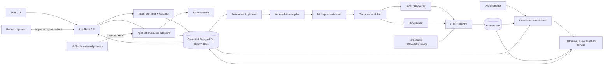
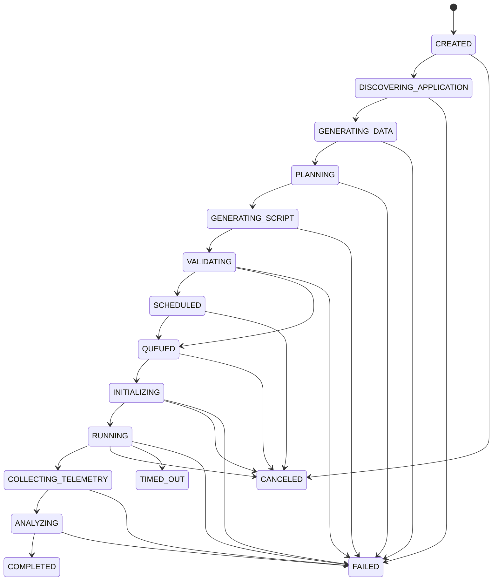

# LoadPilot architecture

LoadPilot is a composition layer around mature performance and observability tools. It owns intent validation, the canonical domain model, lifecycle state, policy, audit, and correlation. It does not fork k6, Prometheus, or the k6 Operator.

## Component ownership

| Capability | Primary owner | Integration |
|---|---|---|
| Natural-language intent | LoadPilot typed compiler; k6 MCP prompts as reference | Validated `PerformanceTestIntent`, never executable prose |
| Schema discovery and data | Schemathesis | Python library behind source adapters |
| Browser/network discovery | k6 Studio | Optional external AGPL process; sanitized HAR import boundary |
| Planning and script generation | LoadPilot deterministic planner/compiler | Templates informed by k6 MCP examples |
| Load execution | k6 | External executable or container |
| Distributed execution | k6 Operator | Optional `TestRun` CRD backend |
| Durable orchestration | Temporal | Workflow commands; LoadPilot database remains lifecycle record |
| Metrics and telemetry | OpenTelemetry Collector + Prometheus | OTLP/Prometheus protocols |
| Alert reduction | Alertmanager + LoadPilot deterministic correlator | Labels, topology, identity, time overlap |
| Evidence-backed RCA | HolmesGPT | Isolated HTTP/service adapter with scoped tools |
| Kubernetes enrichment/remediation | Robusta | Optional service; typed allow-listed actions only |
| UI, audit, history, comparison | LoadPilot | API and React web app |

## Data flow

## Canonical lifecycle

The state in the platform database is canonical. Temporal supplies durable timers, retries, cancellation, and recovery and records commands through idempotent activities; it is not a second user-visible state store.

## Boundaries

- No LLM output is executed. LLM providers may only populate typed schemas; deterministic validation and policy follow.
- Secrets are references resolved at execution time, then redacted before storage, logs, prompts, and artifacts.
- The generated k6 program is template-produced and must pass `k6 inspect` before a backend can start it.
- HolmesGPT gets read-only evidence tools by default. Robusta actions require a LoadPilot action definition, policy evaluation, and audit event.
- Every run owns a telemetry window and identifiers used in k6 tags and Prometheus labels.

